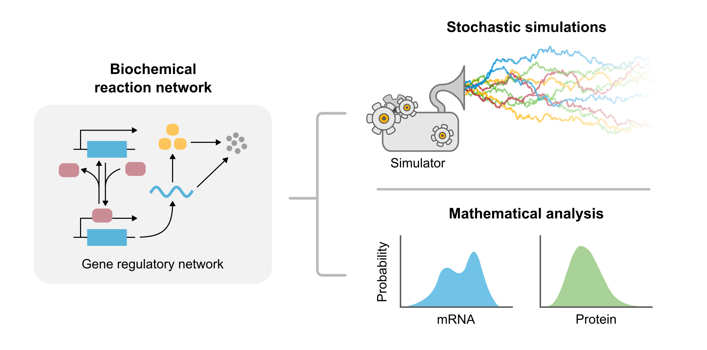

# MIG workshop: Fundamentals of biochemical modelling



### Authors: Lucy Ham, Kaan Öcal and Augustinas Sukys

| Audience      | Prerequisites | Duration    |
| ------------- | ------------- | ----------- |
| Anyone        | Install Julia & Jupyter Notebook   | ~20 mins      |
| Anyone        | Install relevant Julia packages    | ~20 mins      |

## Description

This repository includes all the materials, code and resources for our workshop 'Fundamentals of biochemical modelling'.

## About the Workshop
Mechanistic modelling allows us to understand and predict the dynamics of fundamental cellular processes such as gene expression. This is often achieved by abstracting biological processes into a chemical reaction network that can be analysed using mathematical and computational tools. In this workshop we will cover theoretical and practical aspects of modelling gene expression in single cells, using deterministic and stochastic approaches. Starting with a simple model of mRNA transcription, we will gradually incorporate protein translation, chromatin and cell cycle dynamics, as well as spatial coupling between cells. As a particular focus, we will explore the effects of molecular noise in single cells and its contribution to single-cell heterogeneity.

Throughout the workshop, we will use the Julia programming language, an increasingly popular choice for scientific computing due to its performance and feature-rich package ecosystem.

## Key Learning Objectives
**Introduction to Biochemical Modelling**
   - Understand the fundamental principles of biochemical modelling
   - Explore essential cellular processes such as:
     - Transcription
     - Gene regulation
     - Protein synthesis and degradation
     - Cell-cycle dynamics

**Stochastic Modelling**
   - Learn about stochastic modelling and its application to biology
   - Use **Julia**, a powerful programming language for scientific computing, to simulate biochemical processes

## What You Will Learn
By the end of the workshop, participants will:
- Build and implement a minimal stochastic model of gene expression
- Develop a good understanding of the theoretical and computational aspects of biochemical modelling
- Acquire practical skills to analyse and simulate complex biological systems

## Installation Requirements

### 1. Install Julia

[`juliaup`](https://github.com/julialang/juliaup) is the recommended Julia installer and version manager that is easiest to set up via terminal:

#### macOS / Linux

```bash
curl -fsSL https://install.julialang.org | sh
```

#### Windows

Using `winget`:

```powershell
winget install --name Julia --id 9NJNWW8PVKMN -e -s msstore
```

After installation, verify that Julia and `juliaup` are available:

```bash
julia --version
juliaup status
```

---

### 2. Install IJulia

[IJulia.jl](https://github.com/JuliaLang/IJulia.jl) enables Julia integration with Jupyter notebooks. To install it, start the Julia REPL:

```bash
julia
```

Then install `IJulia` from within the REPL:

```julia
julia> using Pkg

julia> Pkg.add("IJulia")
```

or simply
```julia
julia> ]
pkg> add IJulia
```

---

### 3. Install Jupyter

If you have Jupyter already installed, everything *should* work automatically. Otherwise, this can be done in two ways.

#### Option 1: Install Jupyter via `IJulia`

From the Julia REPL, running the following 

```julia
julia> using IJulia

julia> notebook()
```
can automatically install a minimal Jupyter and Python environment.

#### Option 2: Install Jupyter via Python / Conda

Using `pip`:

```bash
$ pip install jupyterlab
```

Using Conda:

```bash
$ conda install jupyterlab
```

`IJulia` *should* automatically register Julia as an available Jupyter kernel, which can be launched in the classic notebook interface with:

```bash
$ jupyter notebook
```

---

### 4. Install Julia Packages

Julia's built-in package manager allows us to download and install packages from within Julia. **NOTE:** To avoid situations where different Julia-based projects require specific, potentially incompatible package versions, we recommend installing packages inside a project-specific Julia environment (instead of using the global environment for everything). 

If you have cloned the workshop GitHub repository already, open the Julia REPL from within the folder, and use the following commands to create a new environment in the workshop directory and install the needed packages:

```julia
julia> using Pkg

julia> Pkg.activate(".")   # Create a new environment in the project folder  

julia> julia> Pkg.add([
           "Catalyst",
           "DifferentialEquations",
           "Plots",
           "Random",
           "Distributions",
           "Latexify",
           "DiffEqCallbacks"
       ])
```

Unlike Python, but similarly to R, Julia frequently needs to precompile its packages. This may take a while.

Once the installation is completed, Julia will create two files in the project directory that make the environment easily reproducible:
- `Project.toml` — records the direct project dependencies.
- `Manifest.toml` — records the exact package versions and the dependency tree.

---

## Material

Slides: TBA

Practical: TBA

Extra resources:

* **Mathematical Modelling in Systems Biology**, by Brian Ingalls (available at this [link](https://www.math.uwaterloo.ca/~bingalls/MMSB/)): accessible and comprehensive introduction to biochemical modelling.

* **High-Performance Scientific Modeling with Julia and SciML** by Chris Rackauckas (available at this [link](https://github.com/SciML/Julia_Modeling_Workshop)): a vast teaching resource for all things scientific computing in Julia.